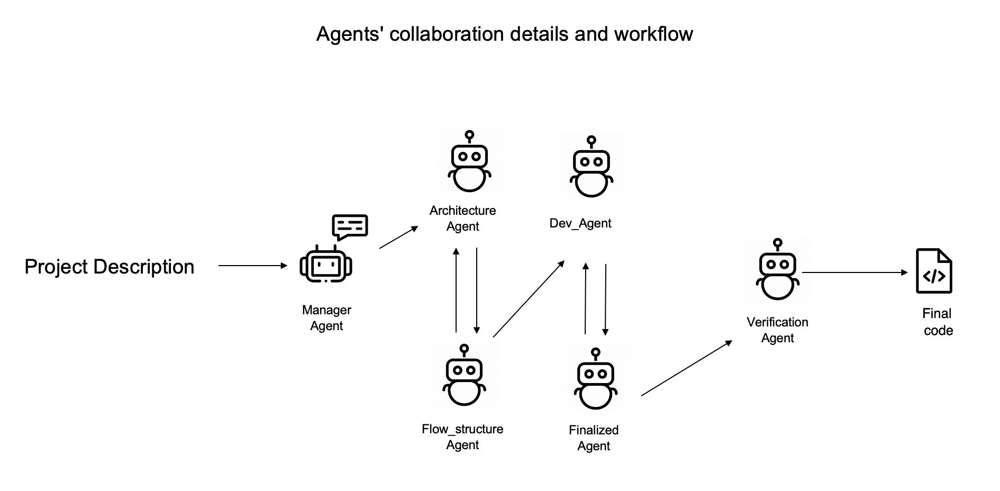

**CodePori_v02**

**Objective**

**CodePori_v02** is a multi-AI agent system designed for autonomous software development. In this system, you provide a project description, and multiple AI agents collaborate to generate code based on the given requirements.

We have implemented **six specialized AI agents**, each responsible for handling creative and complex tasks in software development. These agents work in synergy, focusing on distinct roles:

**Manager Agent** – Takes the project description and collaborates with the Architecture Agent to decompose tasks into multiple modules.

**Architecture Agent** – Defines the overall software structure and assists in breaking down the project into logical components.

**Flow Structure Agent** – Converts the project details into a structured tree format, generating a folder and file hierarchy.

**Dev Agent** – Writes the initial code based on the generated project structure.

**Finalization Agent** – Collaborates with the Dev Agent to refine and optimize the generated code.

**Verification Agent** – Tests the generated code in real-time, identifying potential issues and suggesting improvements. The Finalization Agent and Dev Agent then refine the code based on the Verification Agent's feedback.

As shown in the **figure** below, the Manager Agent initiates the process by analyzing the project description. It then works with the Architecture Agent to decompose the tasks. Once the project structure is defined, the Flow Structure Agent organizes the modules into a hierarchical format. The Dev Agent starts generating code, while the Finalization Agent refines it. Finally, the Verification Agent ensures code quality through real-time testing, and any necessary improvements are integrated before finalization.




# **Getting Started**  

To get this project up and running on your local machine, follow these steps:  

## **Prerequisites**  
Before running the project, you'll need to obtain an **[openrouter.ai](https://openrouter.ai/) API key** and install the necessary dependencies.  

## **Configuration**  

### **1. Set up the OpenRouter API key:**  

- Create a `.env` file in the root directory of the project (if not already present).
-  
- Add your API key in the following format:
- 
  ```plaintext
  
  OPENROUTER_API_KEY=your_api_key_here
  ```
- Save the file. This will ensure the API key is securely loaded into the environment.  

## **Project Description & Execution**  

### **2. Run the application:**  

- Locate the `app.py` file in the repository.
-   
- Execute the script using your preferred Python environment or IDE:
- 
  ```bash
  python app.py
  ```
- The application will launch and prompt you to enter your project description.  

### **3. Provide project details and generate code:** 

- Once the app is running, enter the **project description** or **requirements** in the first input box.
  
- Select the **programming language** for which you want to generate code.
  
- The system, powered by **LLaMA 3.2 Instruct Model** via OpenRouter, will process your request and generate code accordingly.  

## **Copying the Generated Code**  

- After the final code is generated, you can **copy the provided link** (if visible) to access the code.
   
- If the link is not available, manually copy the generated code and paste it into **VS Code** or your preferred editor to execute.  

## **Additional Steps**  

- Before running the generated code, ensure that **all necessary libraries** are installed.
- If your project involves a dataset, you may need to **upload the required dataset** before executing the code.  
- Depending on the complexity, you might need to make minor modifications to ensure proper execution.  


